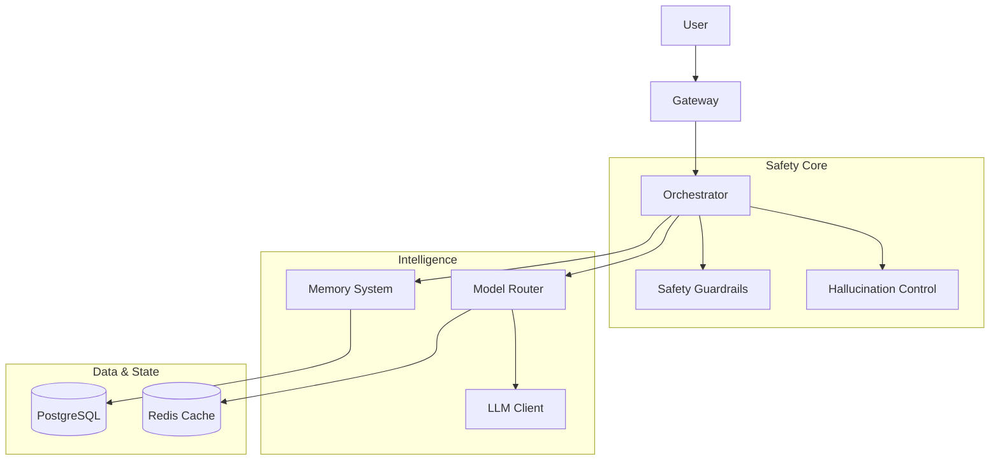

# System Architecture

## Overview
The system follows a microservices-style modular architecture designed for safety and privacy.

## detailed Components

### 1. Conversation Orchestrator (`src/orchestration/orchestrator.py`)
The central nervous system. It strictly enforces the following pipeline:
1.  **Input Risk Audit**: Checks for crisis keywords immediately.
2.  **Safety Classification**: Determines if the query is CRISIS, HIGH, MEDIUM, or LOW risk.
3.  **Context Retrieval**: Fetches *only* relevant anonymized summaries.
4.  **Response Generation**: Uses the appropriate model prompt.
5.  **Output Validation**: Scans generated text for diagnostic language or forbidden advice.
6.  **Async Memory Update**: Updates summaries in the background to reduce latency.

### 2. Memory System (`src/memory/`)
**Design Philosophy**: "Gist-based" storage.
- **Never Stored**: Raw messages, names, locations.
- **Stored**: Relationship status (married/single), Recurring themes (trust issues), Emotional patterns (anxious).
- **Implementation**: PostgreSQL `JSONB` columns `relationship_context`, `recurring_themes` updated via safe LLM summarization.

### 3. Safety Guardrails (`src/orchestration/safety.py`)
- **Layer 1 (Input)**: Regex/Keyword matching for "suicide", "kill", "harm". Triggers Hard Refusal.
- **Layer 2 (Output)**: Regex checks for "You have [Condition]", "You should [Action]". Triggers Regeneration.
- **Layer 3 (Protocol)**: Specific prompts for Crisis situations that provide resources (988) and terminate the specific thread.
